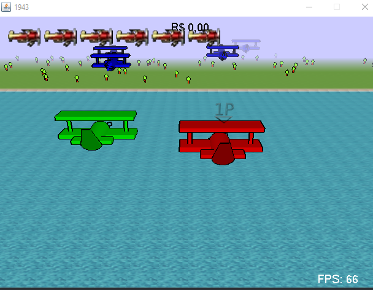
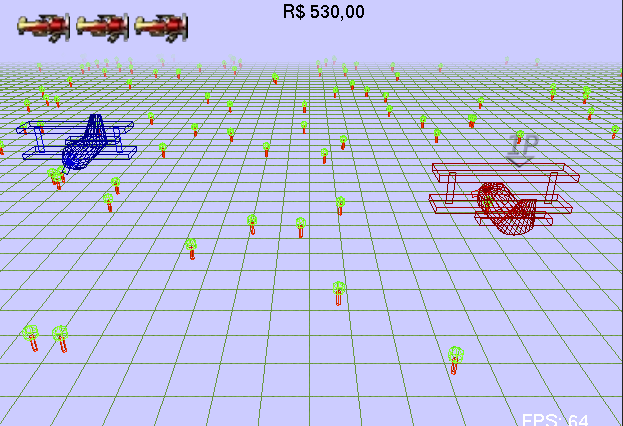

# 1943 Clone



## Introduction

This is a game I developed in September 2010 using Java and JOGL, when life was easier. I found it lost in an old Hotmail account, tried to run on a moderm machine and it worked. So thought I should share with the world.

The game is not optimized in any way, models are not instanced and, in fact, rebuilt every frame, also I didn't understand the concept of vertex buffers or shaders.\
This means that it uses GL_BEGIN and GL_END for each mesh and the Outline effect is achieved by drawing the plane a second time using a black color and wireframe.

The game library was updated to run on 64-bits environments and translated from Portuguese to reach a broader audience.

## Features

- Airplanes and Tree models are recreated every frame
- 640x480 resolution, so you can look away easier
- An amazing total of THREE Biomes procedurally generated: Sea, Beach and Forest
- Difficulty progression
- No sound, so you can listen to your own Spotify playlist (or MP3 player back in 2010)
- Two players mode
- Score that is not in anyway saved so you don't regret past mistakes
- Wireframe mode



## Known issues

- Not optimized in any way
- The code is 10 years old, therefore, horrible
- Game Over screen may disappear too fast if you're pressing a button when you die
- First player always get the score in the end, it's not a fair competition
- Some enemies my "shift" positions when the level changes
- Outline may not be synced with the actual model
- Trees don't look like trees

## Building

First you need to install a Java SDK (preferably OpenSDK).
Then run the commands in `build.cmd` on Windows or `build.sh` on Linux.

## Running

Once build you just need to run the JAR:

```[bash]
cd build
java -jar 1943.jar
```

## Controls

Menus:\
WASD or ARROW KEYS: Move selection, change values\
Enter: Confirm

Player 1:\
WASD: Movement\
Space: Shoot

Player 2:
ARROW KEYS: Movement\
NUM-0: Shoot

## License

MIT... but why?
